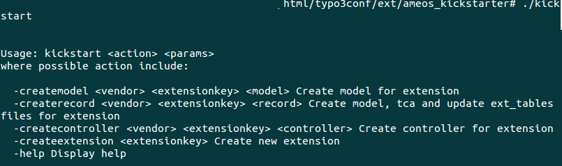

Usage
=====

How use it
----------

Run ./kickstart script : kickstart \<action\> \<param\>

Where possible action include: 

  * -createmodel \<vendor\> \<extensionkey\> \<model\> Create model for extension 
  * -createrecord \<vendor\> \<extensionkey\> \<record\> Create model, tca and update ext_tables files for extension
  * -createcontroller \<vendor\> \<extensionkey\> \<controller\> Create controller for extension
  * -createextension \<extensionkey\> Create new extension
  * -help Display help

Screenshots
-----------

Example

